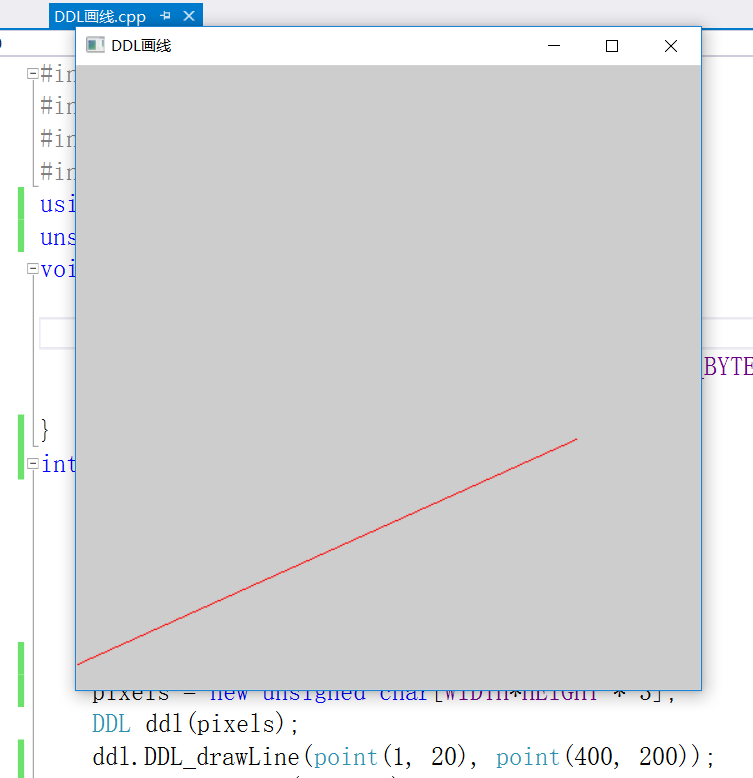
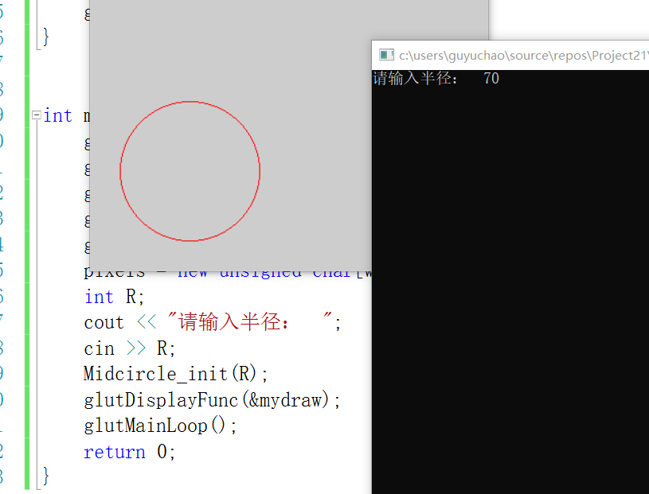
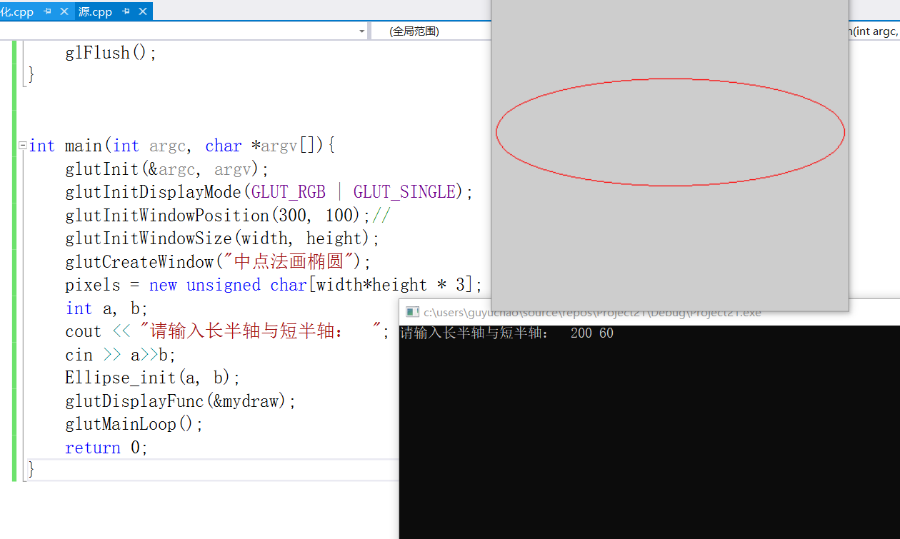
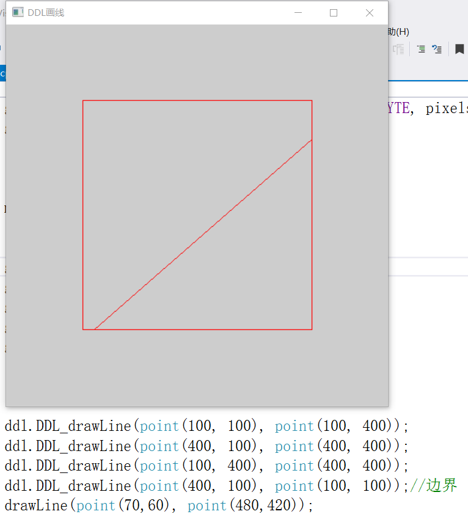
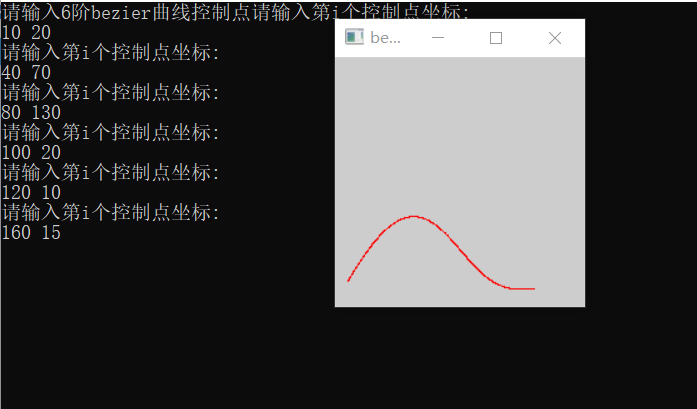

# Computer-Graphics

> Author: Yuchao Gu

> E-mail: 2015014178@buct.edu.cn

> Date: 2017-12-27

>Description: 图形学算法实现

## 功能概览

### DDL画线

### 中点画圆

### 中点画椭圆

### 填充算法

### 裁剪算法

### bezier曲线

## 环境

* 系统支持：`windows` 

* 编程环境：`vs2017`